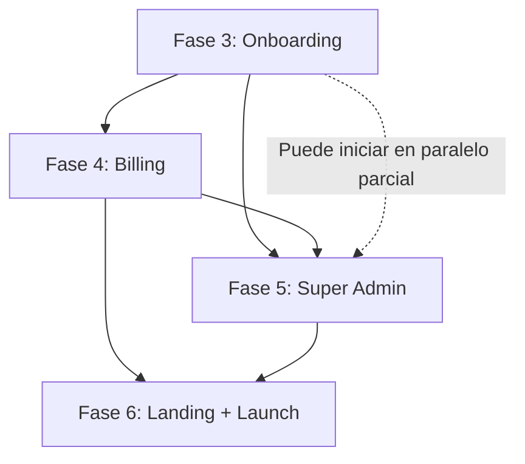

# Plan de Implementación SaaS por Fases — IPUC Contabilidad

> **Fecha:** 12 de febrero de 2026  
> **Proyecto:** IPUC Contabilidad → SaaS Multi-Iglesia  
> **Stack:** Next.js 16.1.1 + Supabase (PostgreSQL + Auth + RLS) + Vercel  
> **Basado en:** Mejores prácticas de Supabase, Next.js App Router y Stripe  

---

## Índice

1. [Estado Actual — Fases 0-2 Completadas](#1-estado-actual)
2. [Fase 3 — Onboarding de Organizaciones](#2-fase-3)
3. [Fase 4 — Billing, Planes y Suscripciones](#3-fase-4)
4. [Fase 5 — Panel Super Admin](#4-fase-5)
5. [Fase 6 — Landing Page y Lanzamiento](#5-fase-6)
6. [Directrices Arquitectónicas Transversales](#6-directrices)
7. [Cronograma y Dependencias](#7-cronograma)

---

## 1. Estado Actual — Fases 0-2 Completadas {#1-estado-actual}

### Fase 0: Seguridad (~95%)
| Ítem | Estado | Notas |
|---|:---:|---|
| Funciones con `search_path` inmutable | ✅ | Todas con `SET search_path = ''` |
| Vistas `SECURITY DEFINER` corregidas | ✅ | Cambiadas a `security_invoker` |
| Tablas backup con RLS | ✅ | `pagos_backup`, `votos_backup` |
| Políticas RLS permisivas/restrictivas | ✅ | Recursión infinita en `organizacion_usuarios` corregida |
| HaveIBeenPwned | ⚠️ | Manual: Dashboard Supabase → Auth → Settings |
| MFA (TOTP) | ⚠️ | Manual: Dashboard Supabase → Auth → MFA |

### Fase 1: Multi-Tenancy DB (100%)
| Ítem | Estado |
|---|:---:|
| Tabla `organizaciones` (tenants) | ✅ |
| Tabla `organizacion_usuarios` (pivote) | ✅ |
| `organizacion_id` en 15 tablas | ✅ |
| Defaults dinámicos `private.get_user_org_id_or_default()` | ✅ |
| Funciones SECURITY DEFINER anti-recursión | ✅ |
| Políticas RESTRICTIVE por tenant en todas las tablas | ✅ |
| Índices en `organizacion_id` | ✅ |

### Fase 2: Frontend Multi-Tenant (~95%)
| Ítem | Estado |
|---|:---:|
| `OrganizationContext` con cookie multi-org | ✅ |
| Middleware con org-slug URL rewrite | ✅ |
| `OrgLink` (47 archivos migrados) | ✅ |
| `useOrgRouter` (27 archivos migrados) | ✅ |
| `OrgSwitcher` para multi-org | ✅ |
| PDFs/Excel con branding dinámico | ✅ |
| Build limpio (0 errores) | ✅ |
| Tests E2E | ⏳ |

---

## 2. Fase 3 — Onboarding de Organizaciones {#2-fase-3}

> **Duración estimada:** 2-3 semanas  
> **Objetivo:** Permitir que nuevas iglesias se registren y configuren su organización de forma autónoma.

### 3.1 Modelo de Datos

#### 3.1.1 Extensiones a `organizaciones`

```sql
ALTER TABLE organizaciones ADD COLUMN IF NOT EXISTS
  configuracion jsonb DEFAULT '{
    "moneda": "COP",
    "zona_horaria": "America/Bogota",
    "idioma": "es",
    "formato_fecha": "DD/MM/YYYY"
  }'::jsonb;

ALTER TABLE organizaciones ADD COLUMN IF NOT EXISTS
  contacto jsonb DEFAULT '{}'::jsonb;
  -- { "pastor": "", "telefono": "", "email": "", "direccion": "", "ciudad": "", "departamento": "" }

ALTER TABLE organizaciones ADD COLUMN IF NOT EXISTS
  personalizacion jsonb DEFAULT '{}'::jsonb;
  -- { "color_primario": "#3b82f6", "color_secundario": "#1e40af" }
```

#### 3.1.2 Tabla de Invitaciones

```sql
CREATE TABLE invitaciones (
  id uuid PRIMARY KEY DEFAULT gen_random_uuid(),
  organizacion_id uuid NOT NULL REFERENCES organizaciones(id) ON DELETE CASCADE,
  email text NOT NULL,
  rol text NOT NULL DEFAULT 'usuario' CHECK (rol IN ('admin', 'tesorero', 'usuario')),
  token text UNIQUE NOT NULL DEFAULT encode(gen_random_bytes(32), 'hex'),
  estado text NOT NULL DEFAULT 'pendiente' CHECK (estado IN ('pendiente', 'aceptada', 'expirada', 'cancelada')),
  invitado_por uuid REFERENCES auth.users(id),
  expires_at timestamptz NOT NULL DEFAULT (now() + interval '7 days'),
  created_at timestamptz DEFAULT now(),
  accepted_at timestamptz,
  UNIQUE(organizacion_id, email)
);

ALTER TABLE invitaciones ENABLE ROW LEVEL SECURITY;

-- Admins de la org pueden ver y gestionar invitaciones
CREATE POLICY "inv_select_org_admin" ON invitaciones
  FOR SELECT TO authenticated
  USING (organizacion_id IN (SELECT private.get_user_org_ids_as_admin()));

CREATE POLICY "inv_insert_org_admin" ON invitaciones
  FOR INSERT TO authenticated
  WITH CHECK (organizacion_id IN (SELECT private.get_user_org_ids_as_admin()));

CREATE POLICY "inv_update_org_admin" ON invitaciones
  FOR UPDATE TO authenticated
  USING (organizacion_id IN (SELECT private.get_user_org_ids_as_admin()));

CREATE POLICY "inv_delete_org_admin" ON invitaciones
  FOR DELETE TO authenticated
  USING (organizacion_id IN (SELECT private.get_user_org_ids_as_admin()));
```

### 3.2 Flow de Registro de Nueva Iglesia

```
┌─────────────────┐    ┌──────────────────┐    ┌───────────────────┐
│ 1. Landing Page  │───▶│ 2. /registro-org │───▶│ 3. Confirm Email  │
│ "Registrar mi    │    │ - Nombre iglesia │    │ (Supabase Auth)   │
│  iglesia"        │    │ - Ciudad/Depto   │    │                   │
│                  │    │ - Pastor         │    │                   │
│                  │    │ - Email admin    │    │                   │
│                  │    │ - Password       │    │                   │
└─────────────────┘    └──────────────────┘    └───────┬───────────┘
                                                       │
                        ┌──────────────────┐           │
                        │ 5. /<slug>/      │◀──────────┘
                        │    dashboard     │    ┌───────────────────┐
                        │ (con datos       │◀───│ 4. Wizard Setup   │
                        │  semilla)        │    │ - Logo (opcional)  │
                        └──────────────────┘    │ - Colores          │
                                                │ - Primer propósito │
                                                │ - Importar miembros│
                                                └───────────────────┘
```

#### 3.2.1 Página `/registro-org` — Archivo: `src/app/registro-org/page.tsx`

```tsx
// Server Action para registro de organización
'use server'

export async function registrarOrganizacion(formData: FormData) {
  const supabase = createServerActionClient()
  
  // 1. Crear usuario en auth.users
  const { data: authData, error: authError } = await supabase.auth.signUp({
    email: formData.get('email'),
    password: formData.get('password'),
    options: {
      data: { nombre: formData.get('nombre_admin') }
    }
  })
  
  // 2. Crear organización (service role — bypasa RLS)
  const serviceClient = createServiceRoleClient()
  const slug = slugify(formData.get('nombre_iglesia'))
  
  const { data: org } = await serviceClient
    .from('organizaciones')
    .insert({
      nombre: formData.get('nombre_iglesia'),
      slug: slug,
      plan: 'gratuito',
      estado: 'activo',
      max_usuarios: 2,
      max_miembros: 50,
      contacto: {
        pastor: formData.get('pastor'),
        ciudad: formData.get('ciudad'),
        departamento: formData.get('departamento')
      }
    })
    .select()
    .single()
  
  // 3. Crear membresía admin
  await serviceClient.from('organizacion_usuarios').insert({
    organizacion_id: org.id,
    usuario_id: authData.user.id,
    rol: 'admin',
    estado: 'activo'
  })
  
  // 4. Datos semilla
  await seedOrganizacionDefaults(serviceClient, org.id)
}
```

#### 3.2.2 Función de Datos Semilla

```typescript
// src/lib/seed/organizacion-defaults.ts
export async function seedOrganizacionDefaults(client: SupabaseClient, orgId: string) {
  // Propósito inicial de bienvenida
  await client.from('propositos').insert({
    organizacion_id: orgId,
    nombre: 'Ofrenda General',
    descripcion: 'Propósito general para ofrendas y diezmos',
    meta: 0,
    estado: 'activo'
  })
}
```

### 3.3 Sistema de Invitaciones por Email

#### 3.3.1 Supabase Edge Function para Envío

> **Ref:** Supabase docs — Custom Auth Email Handler with Resend  
> Usar **Resend** como proveedor SMTP transaccional.

```typescript
// supabase/functions/send-invitation/index.ts
import "jsr:@supabase/functions-js/edge-runtime.d.ts"
import { Resend } from 'npm:resend@4.0.0'

const resend = new Resend(Deno.env.get('RESEND_API_KEY'))

Deno.serve(async (req: Request) => {
  const { email, orgName, inviterName, token, rol } = await req.json()
  
  const inviteUrl = `${Deno.env.get('APP_URL')}/invitacion/${token}`
  
  const { error } = await resend.emails.send({
    from: 'IPUC Contabilidad <noreply@ipuccontabilidad.com>',
    to: [email],
    subject: `${inviterName} te invitó a ${orgName}`,
    html: `
      <h2>Has sido invitado a ${orgName}</h2>
      <p>${inviterName} te ha invitado como <strong>${rol}</strong>.</p>
      <a href="${inviteUrl}" style="
        background: #3b82f6; color: white; padding: 12px 24px;
        border-radius: 8px; text-decoration: none; display: inline-block;
      ">Aceptar Invitación</a>
      <p><small>Este enlace expira en 7 días.</small></p>
    `
  })
  
  return new Response(JSON.stringify({ success: !error }), {
    headers: { 'Content-Type': 'application/json' }
  })
})
```

#### 3.3.2 Página de Aceptación — `src/app/invitacion/[token]/page.tsx`

```
1. Validar token (no expirado, estado 'pendiente')
2. Si usuario ya tiene cuenta → login → aceptar invitación
3. Si usuario no tiene cuenta → registro simplificado → aceptar
4. INSERT en organizacion_usuarios con rol de la invitación
5. UPDATE invitaciones SET estado = 'aceptada'
6. Redirect a /<slug>/dashboard
```

### 3.4 Panel de Settings de Organización

**Ruta:** `/<slug>/dashboard/admin/settings`

| Tab | Campos | Roles |
|---|---|---|
| **General** | Nombre, slug, pastor, contacto | admin |
| **Personalización** | Logo (Supabase Storage), colores | admin |
| **Miembros** | Lista de usuarios + roles, invitar | admin |
| **Límites** | Uso actual vs plan (readonly) | admin |

### 3.5 Archivos a Crear — Fase 3

```
src/
├── app/
│   ├── registro-org/
│   │   ├── page.tsx              # Formulario de registro
│   │   └── actions.ts            # Server actions
│   ├── invitacion/
│   │   └── [token]/
│   │       └── page.tsx          # Aceptar invitación
│   └── dashboard/
│       └── admin/
│           └── settings/
│               ├── page.tsx      # Panel de configuración
│               └── components/
│                   ├── GeneralSettings.tsx
│                   ├── PersonalizacionSettings.tsx
│                   ├── MiembrosSettings.tsx
│                   └── InvitarUsuarioModal.tsx
├── lib/
│   ├── seed/
│   │   └── organizacion-defaults.ts
│   └── utils/
│       └── slugify.ts
supabase/
└── functions/
    └── send-invitation/
        └── index.ts
```

### 3.6 Migraciones SQL — Fase 3

| # | Migración | Descripción |
|---|---|---|
| 1 | `add_org_config_columns` | Columnas `configuracion`, `contacto`, `personalizacion` en `organizaciones` |
| 2 | `create_invitaciones_table` | Tabla + RLS + índices |
| 3 | `add_onboarding_completed` | Flag `onboarding_completo boolean DEFAULT false` en `organizaciones` |
| 4 | `create_slug_unique_function` | Trigger que garantiza slugs únicos con sufijo numérico |

### 3.7 Validaciones Críticas

```typescript
// Middleware: verificar que slug existe y usuario pertenece a la org
// Ya implementado en middleware.ts — 5d. /<slug>/dashboard/...

// Server Action: verificar autorización
// Ref: Next.js best practice — Authorization Check in Server Action
'use server'
import { verifySession } from '@/app/lib/dal'

export async function updateOrgSettings(formData: FormData) {
  const session = await verifySession()
  const userRole = session?.user?.role
  
  // Solo admin puede modificar settings
  if (userRole !== 'admin') {
    return { error: 'No autorizado' }
  }
  // Proceder con la actualización...
}
```

---

## 3. Fase 4 — Billing, Planes y Suscripciones {#3-fase-4}

> **Duración estimada:** 3-4 semanas  
> **Objetivo:** Monetizar la plataforma con planes escalonados y pagos recurrentes.

### 4.1 Modelo de Datos

#### 4.1.1 Tabla `planes`

```sql
CREATE TABLE planes (
  id text PRIMARY KEY, -- 'gratuito', 'basico', 'profesional', 'enterprise'
  nombre text NOT NULL,
  descripcion text,
  precio_mensual_cop integer NOT NULL DEFAULT 0, -- en pesos colombianos
  precio_anual_cop integer NOT NULL DEFAULT 0,
  max_usuarios integer NOT NULL DEFAULT 2,
  max_miembros integer NOT NULL DEFAULT 50,
  max_comites integer NOT NULL DEFAULT 1,
  features jsonb DEFAULT '[]'::jsonb,
  -- ['reportes_pdf', 'exportar_excel', 'proyectos_venta', 'api_acceso', 'soporte_prioritario']
  stripe_price_id_mensual text, -- ID del precio en Stripe
  stripe_price_id_anual text,
  activo boolean DEFAULT true,
  orden integer DEFAULT 0,
  created_at timestamptz DEFAULT now()
);

-- Datos iniciales
INSERT INTO planes (id, nombre, precio_mensual_cop, precio_anual_cop, max_usuarios, max_miembros, max_comites, features, orden) VALUES
('gratuito', 'Gratuito', 0, 0, 2, 50, 1, '["votos_pagos_basico"]', 0),
('basico', 'Básico', 49900, 479000, 5, 200, 3, '["votos_pagos_basico","reportes_pdf","propositos"]', 1),
('profesional', 'Profesional', 99900, 959000, 15, 500, -1, '["votos_pagos_basico","reportes_pdf","propositos","exportar_excel","proyectos_venta"]', 2),
('enterprise', 'Enterprise', 199900, 1919000, -1, -1, -1, '["votos_pagos_basico","reportes_pdf","propositos","exportar_excel","proyectos_venta","api_acceso","soporte_prioritario","sso"]', 3);
-- max = -1 significa ilimitado
```

#### 4.1.2 Tabla `suscripciones`

```sql
CREATE TABLE suscripciones (
  id uuid PRIMARY KEY DEFAULT gen_random_uuid(),
  organizacion_id uuid NOT NULL REFERENCES organizaciones(id) ON DELETE CASCADE,
  plan_id text NOT NULL REFERENCES planes(id),
  stripe_customer_id text,
  stripe_subscription_id text UNIQUE,
  estado text NOT NULL DEFAULT 'active'
    CHECK (estado IN ('trialing', 'active', 'past_due', 'canceled', 'unpaid', 'paused')),
  periodo text NOT NULL DEFAULT 'mensual' CHECK (periodo IN ('mensual', 'anual')),
  trial_start timestamptz,
  trial_end timestamptz,
  current_period_start timestamptz,
  current_period_end timestamptz,
  cancel_at_period_end boolean DEFAULT false,
  canceled_at timestamptz,
  created_at timestamptz DEFAULT now(),
  updated_at timestamptz DEFAULT now(),
  UNIQUE(organizacion_id) -- Una suscripción activa por org
);

ALTER TABLE suscripciones ENABLE ROW LEVEL SECURITY;

CREATE POLICY "sub_select_member" ON suscripciones
  FOR SELECT TO authenticated
  USING (organizacion_id IN (SELECT private.get_user_org_ids()));

CREATE POLICY "sub_update_admin" ON suscripciones
  FOR UPDATE TO authenticated
  USING (organizacion_id IN (SELECT private.get_user_org_ids_as_admin()));
```

### 4.2 Integración con Stripe

> **Ref:** Stripe docs — POST /v1/checkout/sessions (Subscription)  
> **Alternativa LATAM:** ePayco o PayU para pagos en COP  
> **Estrategia:** Stripe como procesador principal + checkout session hosted

#### 4.2.1 Setup de Stripe

```bash
npm install stripe @stripe/stripe-js
```

Variables de entorno:
```env
STRIPE_SECRET_KEY=sk_live_...
STRIPE_PUBLISHABLE_KEY=pk_live_...
STRIPE_WEBHOOK_SECRET=whsec_...
NEXT_PUBLIC_STRIPE_PUBLISHABLE_KEY=pk_live_...
```

#### 4.2.2 API Route — Crear Sesión de Checkout

```typescript
// src/app/api/stripe/checkout/route.ts
import Stripe from 'stripe'
import { createRouteHandlerClient } from '@supabase/auth-helpers-nextjs'

const stripe = new Stripe(process.env.STRIPE_SECRET_KEY!)

export async function POST(req: Request) {
  const { priceId, orgId, periodo } = await req.json()
  
  // Verificar que el usuario es admin de la org
  const supabase = createRouteHandlerClient({ cookies })
  const { data: { user } } = await supabase.auth.getUser()
  if (!user) return Response.json({ error: 'No autenticado' }, { status: 401 })
  
  // Obtener o crear Stripe Customer
  const { data: org } = await supabase
    .from('organizaciones')
    .select('nombre')
    .eq('id', orgId)
    .single()
  
  const { data: sub } = await supabase
    .from('suscripciones')
    .select('stripe_customer_id')
    .eq('organizacion_id', orgId)
    .maybeSingle()
  
  let customerId = sub?.stripe_customer_id
  if (!customerId) {
    const customer = await stripe.customers.create({
      email: user.email,
      name: org.nombre,
      metadata: { org_id: orgId }
    })
    customerId = customer.id
  }
  
  // Ref: Stripe — POST /v1/checkout/sessions
  const session = await stripe.checkout.sessions.create({
    customer: customerId,
    line_items: [{ price: priceId, quantity: 1 }],
    mode: 'subscription',
    success_url: `${process.env.NEXT_PUBLIC_APP_URL}/dashboard/admin/billing?success=true`,
    cancel_url: `${process.env.NEXT_PUBLIC_APP_URL}/dashboard/admin/billing?canceled=true`,
    subscription_data: {
      trial_period_days: 14,
      metadata: { org_id: orgId }
    },
    allow_promotion_codes: true,
  })
  
  return Response.json({ url: session.url })
}
```

#### 4.2.3 Webhook de Stripe

```typescript
// src/app/api/stripe/webhook/route.ts
import Stripe from 'stripe'

const stripe = new Stripe(process.env.STRIPE_SECRET_KEY!)

export async function POST(req: Request) {
  const body = await req.text()
  const sig = req.headers.get('stripe-signature')!
  
  let event: Stripe.Event
  try {
    event = stripe.webhooks.constructEvent(body, sig, process.env.STRIPE_WEBHOOK_SECRET!)
  } catch (err) {
    return Response.json({ error: 'Firma inválida' }, { status: 400 })
  }
  
  const serviceClient = createServiceRoleClient()
  
  switch (event.type) {
    case 'checkout.session.completed': {
      const session = event.data.object as Stripe.Checkout.Session
      const orgId = session.subscription_data?.metadata?.org_id
      
      await serviceClient.from('suscripciones').upsert({
        organizacion_id: orgId,
        stripe_customer_id: session.customer,
        stripe_subscription_id: session.subscription,
        estado: 'active',
        plan_id: 'basico' // Resolver desde el price_id
      })
      break
    }
    
    case 'customer.subscription.updated': {
      const subscription = event.data.object as Stripe.Subscription
      await serviceClient.from('suscripciones')
        .update({
          estado: subscription.status,
          current_period_start: new Date(subscription.current_period_start * 1000).toISOString(),
          current_period_end: new Date(subscription.current_period_end * 1000).toISOString(),
          cancel_at_period_end: subscription.cancel_at_period_end,
          updated_at: new Date().toISOString()
        })
        .eq('stripe_subscription_id', subscription.id)
      break
    }
    
    case 'customer.subscription.deleted': {
      const subscription = event.data.object as Stripe.Subscription
      await serviceClient.from('suscripciones')
        .update({
          estado: 'canceled',
          canceled_at: new Date().toISOString()
        })
        .eq('stripe_subscription_id', subscription.id)
      
      // Downgrade a plan gratuito
      const { data: sub } = await serviceClient
        .from('suscripciones')
        .select('organizacion_id')
        .eq('stripe_subscription_id', subscription.id)
        .single()
      
      if (sub) {
        await serviceClient.from('organizaciones')
          .update({ plan: 'gratuito' })
          .eq('id', sub.organizacion_id)
      }
      break
    }
    
    case 'invoice.payment_failed': {
      // Marcar como past_due, enviar email de aviso
      break
    }
  }
  
  return Response.json({ received: true })
}
```

### 4.3 Enforcement de Límites por Plan

#### 4.3.1 Función de Verificación (DB)

```sql
CREATE OR REPLACE FUNCTION private.check_plan_limit(
  p_org_id uuid,
  p_resource text -- 'usuarios', 'miembros', 'comites'
)
RETURNS boolean
LANGUAGE plpgsql
SECURITY DEFINER
SET search_path = ''
AS $$
DECLARE
  v_plan text;
  v_max integer;
  v_current integer;
BEGIN
  SELECT plan INTO v_plan FROM public.organizaciones WHERE id = p_org_id;
  
  CASE p_resource
    WHEN 'usuarios' THEN
      SELECT max_usuarios INTO v_max FROM public.planes WHERE id = v_plan;
      SELECT count(*) INTO v_current FROM public.organizacion_usuarios
        WHERE organizacion_id = p_org_id AND estado = 'activo';
    WHEN 'miembros' THEN
      SELECT max_miembros INTO v_max FROM public.planes WHERE id = v_plan;
      SELECT count(*) INTO v_current FROM public.miembros
        WHERE organizacion_id = p_org_id;
    WHEN 'comites' THEN
      SELECT max_comites INTO v_max FROM public.planes WHERE id = v_plan;
      SELECT count(*) INTO v_current FROM public.comites
        WHERE organizacion_id = p_org_id;
  END CASE;
  
  -- -1 = ilimitado
  IF v_max = -1 THEN RETURN true; END IF;
  
  RETURN v_current < v_max;
END;
$$;
```

#### 4.3.2 Hook Frontend para Límites

```typescript
// src/lib/hooks/usePlanLimits.ts
export function usePlanLimits() {
  const { organization } = useOrganization()
  
  const checkLimit = useCallback(async (resource: 'usuarios' | 'miembros' | 'comites') => {
    const { data, error } = await supabase.rpc('check_plan_limit', {
      p_org_id: organization?.id,
      p_resource: resource
    })
    return { allowed: data === true, error }
  }, [organization])
  
  return { checkLimit }
}
```

### 4.4 Portal de Facturación

**Ruta:** `/<slug>/dashboard/admin/billing`

| Sección | Contenido |
|---|---|
| **Plan actual** | Nombre, precio, features incluidas |
| **Uso** | Barras de progreso: usuarios X/5, miembros X/200 |
| **Próximo pago** | Fecha + monto (desde Stripe) |
| **Cambiar plan** | Cards con comparativa de planes, botón "Upgrade" |
| **Historial** | Tabla de facturas (Stripe Invoice API) |
| **Cancelar** | Botón con confirmación → `cancel_at_period_end = true` |

### 4.5 Archivos a Crear — Fase 4

```
src/
├── app/
│   ├── api/
│   │   └── stripe/
│   │       ├── checkout/route.ts
│   │       ├── webhook/route.ts
│   │       └── portal/route.ts     # Customer Portal redirect
│   └── dashboard/
│       └── admin/
│           └── billing/
│               ├── page.tsx
│               └── components/
│                   ├── PlanCard.tsx
│                   ├── UsageMetrics.tsx
│                   ├── InvoiceHistory.tsx
│                   └── UpgradeModal.tsx
├── lib/
│   ├── stripe/
│   │   ├── client.ts              # Stripe SDK init
│   │   ├── plans.ts               # Plan metadata + price mapping
│   │   └── helpers.ts             # resolveStripePrice, etc.
│   └── hooks/
│       └── usePlanLimits.ts
```

### 4.6 Migraciones SQL — Fase 4

| # | Migración | Descripción |
|---|---|---|
| 1 | `create_planes_table` | Tabla planes + datos seed |
| 2 | `create_suscripciones_table` | Tabla + RLS + índice |
| 3 | `create_check_plan_limit_function` | Función de verificación |
| 4 | `add_plan_enforcement_triggers` | Triggers opcionales para INSERT que verifican límites |

---

## 4. Fase 5 — Panel Super Admin {#4-fase-5}

> **Duración estimada:** 2-3 semanas  
> **Objetivo:** Dashboard global para administrar todas las organizaciones, monitorear uso y gestionar la plataforma.

### 5.1 Modelo de Datos

#### 5.1.1 Nuevo Rol: `super_admin`

```sql
-- Los super_admin NO pertenecen a una sola org; acceden a TODO
-- Ya contemplado en organizacion_usuarios.rol CHECK

-- Vista materializada para KPIs globales (refresh cada hora)
CREATE MATERIALIZED VIEW admin_kpis AS
SELECT
  (SELECT count(*) FROM organizaciones WHERE estado = 'activo') as total_orgs,
  (SELECT count(*) FROM organizaciones WHERE plan != 'gratuito') as orgs_pago,
  (SELECT count(*) FROM organizacion_usuarios WHERE estado = 'activo') as total_usuarios,
  (SELECT count(*) FROM miembros) as total_miembros,
  (SELECT sum(p.precio_mensual_cop)
   FROM organizaciones o JOIN planes p ON o.plan = p.id
   WHERE o.estado = 'activo' AND o.plan != 'gratuito') as mrr_cop,
  now() as refreshed_at;

CREATE UNIQUE INDEX ON admin_kpis(refreshed_at);
```

#### 5.1.2 Tabla de Feature Flags

```sql
CREATE TABLE feature_flags (
  id text PRIMARY KEY,
  descripcion text,
  habilitado_global boolean DEFAULT false,
  orgs_habilitadas uuid[] DEFAULT '{}',
  created_at timestamptz DEFAULT now()
);
```

#### 5.1.3 Tabla de Audit Log

```sql
CREATE TABLE audit_log (
  id uuid PRIMARY KEY DEFAULT gen_random_uuid(),
  organizacion_id uuid REFERENCES organizaciones(id),
  usuario_id uuid REFERENCES auth.users(id),
  accion text NOT NULL, -- 'create', 'update', 'delete'
  entidad text NOT NULL, -- 'miembro', 'voto', 'pago', etc.
  entidad_id uuid,
  datos_antes jsonb,
  datos_despues jsonb,
  ip_address inet,
  user_agent text,
  created_at timestamptz DEFAULT now()
);

-- Índices para búsqueda rápida
CREATE INDEX idx_audit_org_fecha ON audit_log(organizacion_id, created_at DESC);
CREATE INDEX idx_audit_usuario ON audit_log(usuario_id, created_at DESC);
```

### 5.2 Rutas del Super Admin

**Prefijo:** `/super-admin/` (fuera del patrón `/<slug>/dashboard/`)

```
/super-admin/
├── page.tsx                    # Dashboard con KPIs
├── organizaciones/
│   ├── page.tsx                # Lista con filtros y búsqueda
│   └── [id]/page.tsx           # Detalle de una org
├── usuarios/
│   └── page.tsx                # Todos los usuarios globales
├── billing/
│   └── page.tsx                # Resumen de suscripciones y MRR
├── feature-flags/
│   └── page.tsx                # Gestión de flags
├── audit-log/
│   └── page.tsx                # Log global de auditoría
└── soporte/
    └── page.tsx                # Tickets (futuro)
```

### 5.3 Middleware para Super Admin

```typescript
// Agregar al middleware.ts existente
const SUPER_ADMIN_PATHS = ['/super-admin']

if (pathname.startsWith('/super-admin')) {
  if (!user) {
    return NextResponse.redirect(new URL('/login', request.url))
  }
  
  // Verificar rol super_admin
  const { data: isSuperAdmin } = await supabase
    .from('organizacion_usuarios')
    .select('id')
    .eq('usuario_id', user.id)
    .eq('rol', 'super_admin')
    .eq('estado', 'activo')
    .limit(1)
    .maybeSingle()
  
  if (!isSuperAdmin) {
    return NextResponse.redirect(new URL('/dashboard', request.url))
  }
}
```

### 5.4 Dashboard Global — KPIs

| Métrica | Fuente | Visualización |
|---|---|---|
| **Total organizaciones** | `organizaciones` | Número + gráfico de crecimiento |
| **Orgs activas (7d)** | `audit_log` | Número + porcentaje |
| **MRR (COP)** | `suscripciones × planes` | Número + tendencia |
| **Churn mensual** | `suscripciones.canceled_at` | Porcentaje |
| **Usuarios activos** | `organizacion_usuarios` | Número |
| **Distribución de planes** | `organizaciones.plan` | Pie chart |
| **Uso promedio** | `miembros/votos/pagos` | Barras por org |

### 5.5 Acciones del Super Admin

| Acción | Endpoint | Efecto |
|---|---|---|
| **Suspender org** | `PATCH /organizaciones/:id` | `estado = 'suspendido'` → bloquea acceso |
| **Activar org** | `PATCH /organizaciones/:id` | `estado = 'activo'` |
| **Cambiar plan manual** | `PATCH /organizaciones/:id` | Para concesiones/demos |
| **Impersonar usuario** | Cookie temporal | Login como cualquier user (audit logged) |
| **Toggle feature flag** | `PATCH /feature_flags/:id` | Habilitar/deshabilitar features |

### 5.6 Archivos a Crear — Fase 5

```
src/
├── app/
│   └── super-admin/
│       ├── layout.tsx            # Layout con sidebar de super admin
│       ├── page.tsx              # Dashboard KPIs
│       ├── organizaciones/
│       │   ├── page.tsx
│       │   └── [id]/page.tsx
│       ├── usuarios/page.tsx
│       ├── billing/page.tsx
│       ├── feature-flags/page.tsx
│       └── audit-log/page.tsx
├── components/
│   └── super-admin/
│       ├── SuperAdminSidebar.tsx
│       ├── OrgTable.tsx
│       ├── KPICard.tsx
│       ├── MRRChart.tsx
│       └── PlanDistribution.tsx
└── lib/
    └── super-admin/
        ├── actions.ts            # Server actions
        └── queries.ts            # Queries con service role
```

### 5.7 Migraciones SQL — Fase 5

| # | Migración | Descripción |
|---|---|---|
| 1 | `create_feature_flags_table` | Tabla + seed flags iniciales |
| 2 | `create_audit_log_table` | Tabla + índices |
| 3 | `create_admin_kpis_view` | Vista materializada |
| 4 | `create_audit_trigger` | Trigger genérico para tablas principales |
| 5 | `add_super_admin_rls` | Políticas permisivas para `super_admin` en todas las tablas |

---

## 5. Fase 6 — Landing Page y Lanzamiento {#5-fase-6}

> **Duración estimada:** 2-3 semanas  
> **Objetivo:** Página pública de marketing, SEO, y soft launch.

### 6.1 Estructura de la Landing

```
/ (raíz pública)
├── page.tsx                     # Hero + features + CTA
├── precios/page.tsx             # Tabla de planes
├── sobre/page.tsx               # Historia, misión
├── faq/page.tsx                 # Preguntas frecuentes
├── contacto/page.tsx            # Formulario de contacto
├── blog/                        # MDX blog (futuro)
│   ├── page.tsx
│   └── [slug]/page.tsx
└── legal/
    ├── terminos/page.tsx        # Términos de servicio
    └── privacidad/page.tsx      # Política de privacidad
```

### 6.2 Componentes de la Landing

| Sección | Descripción |
|---|---|
| **Hero** | Título, subtítulo, screenshot de la app, CTA "Registrar mi iglesia" |
| **Features** | Grid de 6 cards: Votos, Pagos, Comités, Reportes, Multi-iglesia, Seguridad |
| **Social Proof** | Testimonios de iglesias piloto |
| **Pricing Table** | 4 planes con toggle mensual/anual, CTA por plan |
| **FAQ** | Accordion con preguntas comunes |
| **Footer** | Links legales, redes sociales, contacto |

### 6.3 SEO y Metadata

```typescript
// src/app/layout.tsx (landing)
export const metadata: Metadata = {
  title: 'IPUC Contabilidad — Gestión Integral para Iglesias',
  description: 'Software de contabilidad, votos, pagos y gestión de miembros para iglesias IPUC y organizaciones religiosas.',
  keywords: ['contabilidad iglesia', 'gestión iglesia', 'votos iglesia', 'IPUC', 'software iglesia'],
  openGraph: {
    title: 'IPUC Contabilidad',
    description: 'La plataforma de gestión integral para iglesias',
    images: ['/og-image.png'],
    type: 'website'
  },
  twitter: {
    card: 'summary_large_image'
  }
}
```

### 6.4 Soft Launch — Checklist

| # | Tarea | Prioridad |
|---|---|---|
| 1 | Dominio propio configurado (DNS → Vercel) | Alta |
| 2 | SSL/TLS activo (automático con Vercel) | Alta |
| 3 | Variables de producción en Vercel | Alta |
| 4 | Stripe en modo live (no test) | Alta |
| 5 | Emails transaccionales con dominio propio (Resend) | Alta |
| 6 | 3-5 iglesias piloto registradas | Media |
| 7 | Google Analytics / Plausible configurado | Media |
| 8 | Sentry para error tracking | Media |
| 9 | Backup strategy validada (Supabase PITR) | Media |
| 10 | Documentación de usuario (guía básica) | Baja |
| 11 | Terms of Service y Privacy Policy redactados | Alta |
| 12 | Feedback loop con iglesias piloto (1 semana) | Media |

### 6.5 Archivos a Crear — Fase 6

```
src/
├── app/
│   ├── (landing)/                # Route group para landing
│   │   ├── layout.tsx            # Layout público (navbar + footer)
│   │   ├── page.tsx              # Home/Hero
│   │   ├── precios/page.tsx
│   │   ├── sobre/page.tsx
│   │   ├── faq/page.tsx
│   │   ├── contacto/page.tsx
│   │   └── legal/
│   │       ├── terminos/page.tsx
│   │       └── privacidad/page.tsx
├── components/
│   └── landing/
│       ├── Navbar.tsx
│       ├── Hero.tsx
│       ├── Features.tsx
│       ├── PricingTable.tsx
│       ├── Testimonials.tsx
│       ├── FAQ.tsx
│       └── Footer.tsx
public/
├── og-image.png
├── screenshots/
│   ├── dashboard.png
│   ├── votos.png
│   └── comites.png
└── logo-full.svg
```

---

## 6. Directrices Arquitectónicas Transversales {#6-directrices}

### 6.1 Seguridad — Principios

> **Ref:** Supabase — Row Level Security best practices for AI agents  
> **Ref:** Next.js — Authorization Check in Server Action with Role Verification

| Principio | Implementación |
|---|---|
| **RLS como barrera primaria** | Toda tabla con `organizacion_id` tiene política RESTRICTIVE de tenant |
| **SECURITY DEFINER para lookups** | Funciones en esquema `private` que hacen cross-table checks sin recursión |
| **Doble verificación** | Middleware (server-side) + RLS (DB-side) — nunca depender de uno solo |
| **Server Actions protegidas** | Verificar sesión + rol antes de cualquier mutación |
| **No confiar en el frontend** | `organizacion_id` se asigna por DEFAULT de DB, nunca desde el cliente |

```typescript
// Patrón estándar para Server Actions protegidas
// Ref: Next.js docs — Authentication in Server Actions
'use server'

export async function accionProtegida(formData: FormData) {
  const session = await verifySession()
  if (!session) throw new Error('No autenticado')
  
  const userRole = session.user.role
  if (!['admin', 'tesorero'].includes(userRole)) {
    return { error: 'No autorizado' }
  }
  
  // RLS se encarga del aislamiento de tenant automáticamente
  const { data, error } = await supabase.from('tabla').insert({...})
  // organizacion_id se asigna por DEFAULT via get_user_org_id_or_default()
}
```

### 6.2 Multi-Tenancy — Principios

| Principio | Implementación |
|---|---|
| **Aislamiento a nivel de fila** | `organizacion_id` + RLS RESTRICTIVE |
| **Defaults dinámicos** | `private.get_user_org_id_or_default()` en todas las tablas |
| **URL como fuente de verdad** | `/<org-slug>/dashboard/...` → middleware resuelve org |
| **Contexto en React** | `OrganizationContext` con org activa |
| **Multi-org opt-in** | `OrgSwitcher` solo visible si usuario tiene 2+ orgs |

### 6.3 Performance — Consideraciones

| Tema | Estrategia |
|---|---|
| **Queries con RLS** | Índices en `organizacion_id` para evitar seq scans |
| **Función STABLE** | Todas las funciones RLS helper marcadas como `STABLE` para cache dentro de una transacción |
| **Materialized Views** | KPIs del super admin como vista materializada (refresh cada hora) |
| **Edge caching** | Vercel ISR para landing page, no para dashboard |
| **DB connection pooling** | Supabase connection pooler (PgBouncer) habilitado |

### 6.4 Testing

| Nivel | Herramienta | Scope |
|---|---|---|
| **Unit** | Vitest | Funciones puras, utils, hooks |
| **Integration** | Vitest + Supabase local | Server actions, RLS policies |
| **E2E** | Playwright | Flujos completos: registro → onboarding → CRUD |
| **RLS Testing** | SQL directo | Verificar aislamiento con diferentes `auth.uid()` |

```sql
-- Test RLS: verificar que org A no ve datos de org B
SET LOCAL role = 'authenticated';
SET LOCAL request.jwt.claims = '{"sub":"user-uuid-org-a","role":"authenticated"}';

SELECT count(*) FROM miembros; -- Debe retornar solo miembros de org A
```

---

## 7. Cronograma y Dependencias {#7-cronograma}

```
Semana   1   2   3   4   5   6   7   8   9  10  11  12
        ├───────────┤
        │  Fase 3   │
        │ Onboarding│
        └─────┬─────┘
              │
              ▼
        ├───────────────────┤
        │     Fase 4        │
        │ Billing + Stripe  │
        └─────────┬─────────┘
                  │
                  ▼
              ├───────────┤
              │  Fase 5   │
              │Super Admin │
              └─────┬─────┘
                    │
                    ▼
              ├───────────────┤
              │    Fase 6     │
              │Landing+Launch │
              └───────────────┘
```

### Dependencias entre Fases



| Fase | Depende de | Puede paralelizar con |
|---|---|---|
| Fase 3 | Fases 0-2 (completadas) | — |
| Fase 4 | Fase 3 (orgs deben existir) | Fase 5 (parcial) |
| Fase 5 | Fase 3 + 4 (datos para KPIs) | Fase 6 (parcial) |
| Fase 6 | Todas las anteriores para launch | Fase 5 (landing puede hacerse en paralelo) |

### Resumen de Entregables por Fase

| Fase | Migraciones | Archivos | Edge Functions | APIs |
|---|---|---|---|---|
| **3. Onboarding** | 4 | ~12 | 1 (invitaciones) | 0 |
| **4. Billing** | 4 | ~10 | 0 | 3 (checkout, webhook, portal) |
| **5. Super Admin** | 5 | ~15 | 0 | 0 |
| **6. Landing** | 0 | ~12 | 0 | 1 (contacto) |
| **Total** | **13** | **~49** | **1** | **4** |

---

## Notas Finales

### Decisiones Pendientes por el Equipo

| Decisión | Opciones | Impacto |
|---|---|---|
| **Pasarela de pagos** | Stripe vs ePayco vs PayU | Fase 4 completa |
| **Dominio** | ipuccontabilidad.com vs contabilidadipuc.com | Fase 6, emails |
| **Email transaccional** | Resend vs SendGrid vs AWS SES | Fase 3 (invitaciones) |
| **Blog engine** | MDX integrado vs Notion API vs Headless CMS | Fase 6 |
| **Pricing final** | Valores en COP definidos arriba son sugerencia | Fase 4+6 |

### Riesgos y Mitigaciones

| Riesgo | Probabilidad | Mitigación |
|---|---|---|
| Recursión RLS con nuevas tablas | Media | Template de migración con funciones SECURITY DEFINER |
| Stripe no disponible en Colombia | Baja | ePayco/PayU como alternativa lista |
| Performance con muchas orgs | Baja (mediano plazo) | Índices + STABLE functions + connection pooler |
| Usuarios no completan onboarding | Alta | Wizard simple (3 pasos), skip optional |
| Conflictos de slug | Media | Función de slugify con sufijo numérico automático |

---

> **Siguiente acción recomendada:** Iniciar Fase 3 creando la migración de la tabla `invitaciones` y la página `/registro-org`.
